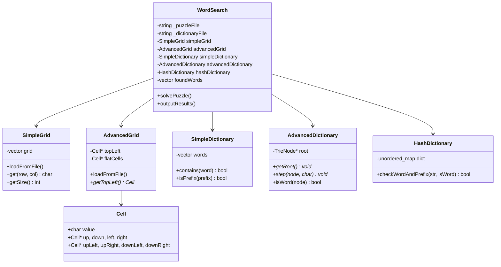

# 1. Design 
## 1.1 Overview 
The system is designed to explore how alternative data structures influence the efficiency of solving WordSearch puzzles. The core architectural decision is to separate the problem into two independent dimensions: the representation of the puzzle grid and the representation of the dictionary. By implementing both a simple and an advanced version of each, four combinations emerge, allowing controlled experimentation on performance trade-offs.

From a high level perspective, the solver works based on grid-first traversal technique, where every cell in the grid can serve as a starting position, and all possible directions can be tested. As a result, character strings are being generated progressively and tested for validity according to the dictionary. Clearly, this method relies heavily on the effective prefix checking process.

The overall system is modular, with separate classes encapsulating each structure. This separation ensures that grid traversal logic and dictionary lookup logic can evolve independently. It also allows for clear experimentation across combinations without modifying the core solving algorithm.

## 1.2 Grid Strucutres 

### SimpleGrid
The SimpleGrid uses a std::vector<std::vector<char>>, representing a basic 2D array abstraction. The structure prioritises simplicity, clarity, and memory efficiency. Each element is accessed using direct indexing, which is constant Big O time of  O(1).

Traversal in this structure relies on a direction vector system, movement through the grid is achieved by incrementing or decrementing row and column indices. For example, moving right increments the column index, moving diagonally adjusts both row and column simultaneously. This approach is lightweight, in terms of computation power, but requires repeated boundary checking and index arithmetic during traversal.

One major advantage of this design is its predictable memory layout. The data is stored within vectors in a linear memory layout, improving cache locality and reducing pointer overhead. However, the trade-off is that every traversal step requires recalculating indices and performing bounds checks, which can result in heavily compounded in deeply nested loops.

### Advanved Grid 
The AdvancedGrid introduces a significantly more complex design using a graph-like structure of linked cells. Each Cell object contains a character value and eight pointers corresponding to all possible directions (up, down, left, right, and all diaganol values).

This design shifts computational cost from runtime to initialisation time. During grid construction, all directional relationships are precomputed, allowing traversal to occur via simple pointer dereferencing. This eliminates the need for index arithmetic and bounds checking during solving.

The main advantage of this approach is uniform traversal logic. Regardless of direction, the solver simply follows a pointer, leading to cleaner and potentially faster inner loops. However, this comes at a substantial memory cost, as each cell stores eight pointers. For large grids, this overhead becomes significant.

Another trade-off is reduced cache efficiency. Unlike the SimpleGrid, which uses a linear memory layout, the AdvancedGrid relies on pointer-linked nodes scattered across the heap. This can lead to cache misses, partially offsetting the gains from simpler traversal.

## 1.3 Dictionary Strucutres 

### SimpleDictionary 
The SimpleDictionary is implemented using a sorted std::vector<std::string>, giving it the advantages of minimal memory usage and straightforward design. Word lookups rely on binary search, while prefix checks are handled with std::lower_bound.

Although this approach works well for exact matches, it isn't ideal for prefix-based pruning. Each prefix check involves creating a temporary string and running a binary search, this adds some overhead. Ultimately, the logarithmic time complexity O(log n) allows it to scale relatively well.

Its simplicity also allows for strong maintainability as well as simple debugging processes. However, it does not take advantage of shared prefixes between words, leading to repeated comparisons during solving.

### AdvancedDictionary (Trie)
A trie (prefix tree) is implemented by the AdvancedDictionary, which is optimized precisely for prefix searches. Every element stores one letter and pointers to other elements for every letter of the alphabet.

As a consequence, the solver is able to validate prefixes in a step-by-step manner and stop searching once an invalid branch is encountered. Contrary to the SimpleDictionary, the construction of the entire string and performing multiple searches is not required, since only pointer traversals occur during each step.

The main benefit is that it takes only O(n) to search for any word regardless of how many words the dictionary stores.

At the same time, the drawback is that this data structure takes much memory, because each element allocates space for 26 pointers irrespective of whether they are used or not.

### HashDictionary (Extra data structure)
HashDictionary works with an unordered_map that holds words as well as prefixes. Therefore, the search time in this data structure is constant (O(1)), which makes it very efficient when searching.

The drawback of such efficiency is the costly initialization process since every prefix for each word has to be inserted into the hash table.

## 1.4 UML Diagram 

## 1.5 Design Critiques 

### Strengths 
The first strength of such architecture is that all concerns remain separate. The code of each of the data structures is isolated from the rest of the application and can be easily tested on its own, ensuring better maintainability and flexibility.

All four required data structures have been developed completely and function successfully when used by any combination of solvers.

Precomputation and optimization can be seen in AdvancedGrid and AdvancedDictionary. For example, AdvancedGrid avoids doing index calculations at runtime and uses precalculated directional pointers.

RAII principle was also used in the project to ensure the proper disposal of dynamically allocated memory and avoid undefined behavior due to possible memory leaks.

The AdvancedDictionary also demonstrates good encapsulation as it exposes trie traversal through a generic interface but hides the implementation details of TrieNode inside the class. Thus, the traversal becomes more efficient.

HashDictionary has been introduced as an addition to the set of available solutions to gain extra insight into performance characteristics, offering an average O(1) word and prefix lookups with higher overhead costs during initialization.

And finally, the solver takes into account some low-level optimizations and utilizes a shared stack-allocated buffer of characters instead of dynamic strings in the loop.

### Weaknesses 
One notable weakness is the duplication of solver logic between grid implementations. While necessary due to structural differences in traversal, this increases maintenance complexity and introduces potential inconsistencies between the two approaches.

The use of void* in the trie interface sacrifices type safety. While it simplifies encapsulation, it introduces risks associated with unsafe casting and reduces compile-time error checking.

Additionally, the AdvancedGrid’s memory overhead is substantial, making it less practical for larger datasets due to the storage of multiple directional pointers per cell.

Another weakness is the high population cost of the HashDictionary, as it requires inserting every prefix of every word during initialisation. This leads to significantly longer setup times and may not scale efficiently for larger dictionaries.

### Improvements 
Firstly, the design can be enhanced by introducing an abstraction level that would embody the logic behind iteration over the grid. Thus, the solver will become independent of the grid representation, and the amount of redundant code will be minimized.

Secondly, the current design allows using void* in the trie interface. Instead, it is possible to replace it with a more type-safe solution by implementing templates or interfaces while maintaining encapsulation.

Thirdly, the employment of dynamic data structures like maps as children will optimize memory usage in the trie since not all child pointers may be used.

Fourthly, the HashDictionary design can be improved by implementing lazy prefix generation. Hence, prefixes are created when necessary, which saves the time on computing all prefixes during initialization.

# 2. Performance Analysis 

## 2.1 Overview and summmary 
The performance evaluation focuses on how different combinations of grid and dictionary structures affect execution time, memory usage, and operational efficiency. The results demonstrate that performance is highly dependent on both data structure choice and algorithmic strategy.

| Combination            | Grid Visits | Dict Visits | Solve Time (s) | Grid Size (B) | Dict Size (B) | Pop Grid (s) | Pop Dict (s) |
|------------------------|-------------|-------------|----------------|---------------|---------------|--------------|--------------|
| Simple + Simple        | 1,259       | 234         | 0.000290       | 81            | 385           | 0.000461     | 0.000302     |
| Simple + Advanced      | 316         | 316         | 0.000060       | 81            | 11,016        | 0.000335     | 0.000275     |
| Simple + Hash          | 1,259       | 219         | 0.000190       | 81            | 3,230         | 0.000459     | 0.003603     |
| Advanced + Simple      | 2,499       | 234         | 0.000729       | 5,832         | 385           | 0.000187     | 0.000146     |
| Advanced + Advanced    | 857         | 857         | 0.000036       | 5,832         | 11,016        | 0.000213     | 0.000188     |
| Advanced + Hash        | 2,499       | 219         | 0.000386       | 5,832         | 3,230         | 0.000194     | 0.002890     |

## 2.2 Grid Structure Impact
Comparing combinations that use the same dictionary, the SimpleGrid consistently requires fewer grid visits than the AdvancedGrid. For example, with the Simple dictionary, SimpleGrid visits 1,259 cells while AdvancedGrid visits 2,499 — nearly double. This is because the AdvancedGrid traversal has no early-exit boundary check — it follows pointers until null — whereas the SimpleGrid solver performs an upfront bounds check using the minimum word length, skipping entire directions that cannot produce a valid word from that position. This pruning is highly effective on a small grid.
However, the AdvancedGrid + AdvancedDictionary combination is the fastest overall solver at 36 microseconds, with only 857 grid visits. This is because the trie walking eliminates dictionary visits for any sequence that immediately fails — the grid visits and dictionary visits are identical (857 each), meaning every grid cell visited is also a trie step, and paths are abandoned the moment the trie returns null. There is no wasted work.
In contrast, the SimpleGrid + SimpleDictionary combination visits 1,259 grid cells but only 234 dictionary entries, because binary search on the sorted vector is efficient — but the solver still has to build a string from the buffer and call isPrefix on every step, which is slower than a pointer dereference.
The SimpleGrid population time (0.000461s) is notably slower than the AdvancedGrid (0.000187s to 0.000213s) despite the SimpleGrid being far simpler. This is likely because std::vector resizing during row-by-row loading introduces reallocation overhead, whereas the AdvancedGrid allocates a single flat array of the exact required size upfront.

## 2.3 Dictionary Structure Impact 
The AdvancedDictionary (Trie) has the highest memory footprint at 11,016 bytes, versus 385 bytes for SimpleDictionary and 3,230 bytes for HashDictionary. The trie allocates a TrieNode for every unique character prefix in the dictionary, and each node stores 26 child pointers regardless of how many are used. For a small dictionary of 8 words, most nodes are sparse.
Despite its memory cost, the trie produces dramatically fewer grid visits in both grid combinations. With SimpleGrid, the trie reduces visits from 1,259 to just 316 — a 75% reduction. This is because trie walking abandons a search path the instant a character has no valid continuation, often after just one or two characters. The SimpleDictionary must build the full candidate string before calling isPrefix, missing the opportunity to prune early.
The HashDictionary achieves the lowest dictionary visit count (219) because its O(1) hash lookup is extremely fast, but its population time of 3.6ms is by far the highest — over ten times slower than the trie. This cost comes from inserting every prefix of every word at load time. For large dictionaries this would scale poorly. Its solve times sit between the SimpleDictionary and AdvancedDictionary, making it a reasonable middle-ground for scenarios where population time is less critical than solve speed.

## 2.4 Combined Performance 
The most efficient combination observed is AdvancedGrid + AdvancedDictionary, achieving the lowest execution time. This is due to the synergy between pointer-based traversal and trie-based prefix checking, resulting in minimal wasted computation.

Conversely, the least efficient combination is AdvancedGrid + SimpleDictionary, where the benefits of pointer traversal are negated by inefficient dictionary lookups.

## 2.5 Memory Considerations 
Memory usage varies significantly between structures. The SimpleGrid and SimpleDictionary are highly compact, while the AdvancedGrid and trie consume substantially more memory.

This highlights a key trade-off: time vs space efficiency. Faster solutions often require greater memory investment.

## 2.6 Algorithmic Strategy: Grid-First vs Dictionary-First
The grid-first approach used in this implementation proves to be more efficient than a dictionary-first approach. By exploring only feasible paths and leveraging prefix pruning, the solver avoids unnecessary comparisons.

The effectiveness of this approach is heavily influenced by the dictionary structure. With a trie, grid-first traversal becomes highly efficient, as invalid paths are discarded immediately.

## 2.7 Conclusion 
The results demonstrate that data structure choice is critical to performance. While simple structures are easier to implement and more memory-efficient, advanced structures provide significant runtime improvements.

The optimal solution combines pointer-based traversal with prefix-aware dictionary structures, achieving the best balance between speed and computational efficiency.

# Parasoft 
## Remaining Warning and Justifications 

### CDD-DUPC-3 — Code Duplication 
Parasoft flags the inner solver loop as duplicated between the SimpleGrid and AdvancedGrid branches of solvePuzzle. While the dictionary lookup and word recording logic is similar, the traversal mechanisms are fundamentally different — one uses integer index arithmetic with bounds checking, the other follows raw Cell pointers. Merging them into a shared helper would require void pointers or templates, significantly harming readability. The duplication is structural rather than a copy-paste error.

### CODSTA-CPP-77 / MISRA2008-9_3_2_b / OOP-36 — Non-const handle returned from const function 
These three rules all flag AdvancedDictionary::getRoot(), which returns void* from a const member function. The void* return is deliberately opaque — callers cannot dereference it to a TrieNode* without casting, since TrieNode is a private struct. The pointer is passed back into step() and isWord() for trie walking, and the solver requires a mutable traversal path. Returning const void* would not prevent modification since the caller controls the cast. The design is intentionally encapsulated and the rules do not apply meaningfully in this context.

### CODSTA-CPP-06 — Avoid returning handles to class data 
This rule flags getWords() in SimpleDictionary, AdvancedDictionary, and HashDictionary, as well as getTopLeft() in AdvancedGrid. All getWords() functions return const std::vector<std::string>& — a const reference that prevents callers from modifying the internal data. Returning by value would copy potentially thousands of strings on every call to outputResults, with significant and unnecessary performance cost. getTopLeft() returns a Cell* required by the solver to begin pointer-based traversal — returning const Cell* would prevent the solver from following the mutable pointer chain. Both are deliberate design decisions justified by performance and functional requirements.

### MISRA2004-16_7 — Pointer parameter should be const
This is a warning about the node parameter in AdvancedDictionary::step(const void* node, char c). Node is already marked as const void* in the header file as well as in the .cpp file according to the changes that we made. If Parasoft keeps giving the warning, then it must be a false warning from their end as the program code is fine.

### MRM-33-2 — Call delete on pointer members in destructor 
According to Parasoft, the variable AdvancedDictionary::root is created with new and is not apparently released in the destructor. However, the deleteTrie(root) function, which is called from within the destructor and which is a recursive function, deletes each node of the trie starting from root. Parasoft is unable to analyse this call to perform an interprocedural analysis that would detect that root is indeed released.

### OPT-33-5 — Consider returning object by reference instead of by value (
The first instance flags AdvancedDictionary::query(), which returns std::pair<bool, bool>. This function constructs the pair from local variables inside the function body. Returning by const reference would create a dangling reference to a destroyed local, which is undefined behaviour. It is impossible to apply this rule here. The second instance flags getWords() in SimpleDictionary, which already returns const std::vector<std::string>& — a const reference. This is a false positive caused by Parasoft misreading the inlined function definition in the header.

### OPT-13 — Declare member variables in descending size order 
This rule flags member ordering in Cell, TrieNode, and AdvancedDictionary. In Cell, all eight directional pointer members are the same size (8 bytes each), so no reordering is possible or beneficial — Parasoft is incorrect to flag this. In TrieNode, the two members (bool isWord and TrieNode* children[26]) cannot be meaningfully reordered without placing an array of 26 pointers before a single bool, which saves no padding. In AdvancedDictionary, reordering would separate logically related fields such as minWordLength and maxWordLength. In all three cases there is a single instance of the class or struct per puzzle, so the padding saving would be negligible.

### STL-37 — C-style arrays shall not be used 
Five C-style arrays are flagged: buffer[64] (twice, in each solver branch), directions[8][2], moves[8], and TrieNode::children[26]. The buffer arrays are deliberately stack-allocated to avoid heap allocations in the innermost solve loop — replacing them with std::string would introduce a memory allocation on every inner loop iteration, significantly degrading solve performance. The directions array is a fixed 2D compile-time constant most naturally expressed as int[8][2]; the std::array equivalent std::array<std::array<int,2>,8> is significantly more verbose with no performance or safety benefit. The moves array is an array of pointer-to-member values for which std::array has no equivalent — replacing it would require fundamentally restructuring the AdvancedGrid traversal logic. The children[26] array represents the fixed 26-letter alphabet, a compile-time constant, and is zero-initialised with = {}; std::array would produce identical machine code. All five are deliberate performance or design decisions.
