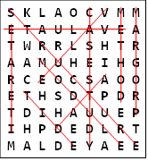
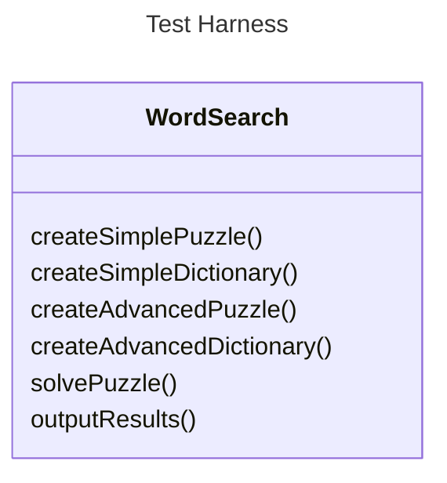

# Final Lab

# Investigation of Alternative Data Structures for WordSearch Puzzles

## Overview

The objective of this assessment is to develop a C++ program to implement alternative data structures for WordSearch puzzles, and related WordSearch dictionaries, and to investigate and report on their operational efficiency.

A WordSearch puzzle comprises a rectangular (normally square) grid of letters in which a number of words are hidden, and the goal of the puzzle is to find all the words present.  The number of words hidden may or may not be specified, and the search may be aided by a dictionary of words to find, or it may be that the topic context is known (e.g. computer science) and the puzzler has to use their knowledge to decide what relevant words they can find.

The words may be hidden within rows, columns or diagonally within the grid, in either direction (see illustration).  Words may also cross over, so one letter cell in the grid may contribute to several words.



If a dictionary is provided to support the searching, this may contain either the target words only, or the target words together with many other words to make the puzzle more challenging.

In this assessment, the puzzle grid can be assumed to be square.  The size of the square is provided in the text file containing the puzzle.  There will also be dictionaries of words to support the search in each puzzle grid.  The objective is to develop and implement relevant data structures to represent the grid and the dictionary for each puzzle, and to evaluate the performance of these data structures as your program solves each puzzle.

Two alternative structures for each aspect are described in more detail below.  The puzzle Grid may be either a simple array of characters, or a linked structure of objects to hold puzzle-letter characters and links; the Dictionary may be an array of Strings or a tree structure of objects to hold word-letter characters and links.

You are required to develop a C++ program that implements all 4 data structures.  You should then add diagnostic code to report on the behaviour of the data structures while solving wordsearch puzzles.  Finally, you must review the different structures and consider their relative efficiency, and document your findings in the lab book.

## Input and Output

Each puzzle will be in a text file called `puzzle.txt` and you are to implement code that can populate the grid of your data structure by reading the letters contained in the file.  The data file consists of a single integer (n),  followed by n * n letters, each in the range A-Z.  You can assume that all letters and words provided are in upper-case format.

As you solve the puzzle using each combination of your data structures, you are to output a number of findings (described later) to appropriately named files i.e.

- `simple_puzzle_simple_dictionary.txt`
- `advanced_puzzle_simple_dictionary.txt`
- `simple_puzzle_advanced_dictionary.txt`
- `advanced_puzzle_advanced_dictionary.txt`

These files must use the format specified in **Appendix A**.

A dictionary will be provided in `dictionary.txt`.

Unseen puzzles and dictionaries will be used in the marking of this assessment and some diagnostics will be performed on your results file.  Therefore, failure to use the correct file names and failure to output findings in the correct format will result in a loss of marks.

## Structures for the Puzzle Grid

- The simplest structure for the puzzle grid is a 2D array of characters.  This can be populated by reading from a given text data file (one line of characters per row of the grid) and traversed simply across rows (back and forth); by columns (up and down) and by diagonals (main and secondary, in either direction) by suitable use of loops or similar constructs, with appropriate adjustment of array-index values.  From each grid position, your program should step along each direction in turn, comparing each letter sequence against the dictionary content to see if each sequence forms a word contained in the dictionary data.  The puzzle's size is defined in the text data file.

- A more advanced data structure recognises that any letter cell in the grid can form part of eight sequences (horizontal, vertical, and two diagonals, each of which may be read in either direction).  Therefore, a data structure can be created based on individual 'letter cell' objects that are linked into sequences that can be uniformly checked by one standard comparison method.  This comparison method would be invoked for each direction from each cell of the puzzle grid in turn, to compare the letter sequences from that point against the dictionary content.  Regular row-by row traversal of this structure will remain possible (e.g., for data loading) by following the forward pointing horizontal links for each row, and the downward vertical links from the first cell in each row, starting from the top left corner.  The puzzle's size is defined in the text data file.

## Structures for the Dictionary

- The simplest structure for the dictionary is an array of `std::string` (or `std::vector<std::string>`).  This can be populated by reading from a text file (one line per word or string value) then searched systematically to match puzzle grid content as the letter sequences are traversed.

- A more advanced data structure recognises that many longer words may begin with the same letter sequence as (or the entirety of) some shorter word(s).  For example, the dictionary may contain the words `PROJECT` and `PROJECTOR`, therefore `PROJECTOR` only requires two more letters matching than the word `PROJECT`.  If the word matching process has to start each dictionary word string from the beginning, then such common sequences will be matched several times until the match is found or the search completely fails.

## Additional data structures (optional)

One of the marking criteria is the performance of your code, with higher marks being awarded for quicker solutions. Provided you have implemented the FOUR required data structures specified above, then you are free to implement additional data structures, to achieve even faster results.

Bonus marks are available for these additional data structures, based on their complexity and performance.

## Implementation

You are required to develop all four of the above data structures (two 'simple' and two 'advanced') and to operate the WordSearch solving process based on each of FOUR combinations, i.e. simple grid and simple dictionary; simple grid and advanced dictionary; advanced grid and simple dictionary; and advanced grid and advanced dictionary.  For each combination, the program must be run with each of the provided trial puzzles and dictionaries and in each case the operational timings must be recorded by use of suitably positioned timing statements.  The number of words matched, the actual words matched, the total number of grid cells (puzzle letters) compared and the number of dictionary entries (or tree nodes) visited, memory used, along with the overall performance timings must be recorded. See Appendix A for the output format.

These observations should then be evaluated and discussed in your report, to derive conclusions with respect to relative operational behaviour of the different combinations of data structures as well the algorithms involved.

You can use any version of C++, provided your application runs within Visual Studio 2022, on the Windows 11 PCs in FEN-052.

No libraries other than those included with C++ are permitted.  If in doubt, please consult one of the module team.

## Test harness

A test harness has been provided to you.  You are to use this to test your implementation.  If you do not implement the functionality of a particular method listed below, then simply output to the console `std::cout` a message stating that the particular method has not been implemented.  You should assume that the given WordSearch class is not well designed C++, and so you will need to use Parasoft to make sure that your final source code does not violate any Parasoft rules.  Parasoft will be used to mark the quality of your C++ implementation.  Implement the following class and class methods:



### Methods:

- Add any appropriate constructors, destructors or operators

- `void createSimplePuzzle()`: This method will read the puzzle and store the letters in the simple grid data structure.

- `void createSimpleDictionary()`: This method will then read the dictionary and store the words in the simple dictionary data structure.

- `void createAdvancedPuzzle()`: This method will then read the puzzle and store the letters in the advanced grid data structure.

- `void createAdvancedDictionary()`: This method will then read the dictionary and store the words in the advanced dictionary data structure.

- `void solvePuzzle()`: This method will solve the puzzle using the available grid data structure and available dictionary data structure.

- `void outputResults()`: This method will output the results in the format descibed in Appendix A to the appropriately named file (see previously).

## Evaluation

You are required to evaluate your solution from a number of perspectives:

### Performance

The duration (in microseconds), should be recorded for each data structure population and puzzle solver, and printed to the output file.

Marks will be awarded based on these execution times, so effiency fast code is a requirement of this assessment.

Make sure you time your code using the **Release** build in Visual Studio.

### Memory usage

The memory size (in bytes), should be calculated for each data structure, and printed to the output file.

Make use of the `sizeof()`.  

If you are using a `std::vector<>` remember that the size if not just size of the vector, but you'll also need to calculate the sizeof the individual elements, multipled by the number of elements.

### Visit counts

You are required to keep a count of both the number of times grid cells and dictionary entries are visited whilst solving a puzzle.

These two visit counts should be printed to the output file.

### Code quality

You are required to run Parasoft C/C++ Static Test on your codebase.

The generated html report should be uploaded onto your GitHub repo.

You might not agree with all the Parasoft C/C++ Static Test results.  In which case you should document this in your lab book (see below). 

## Code submission

Please ensure the following requirements are met when submitting your source code.

- only submit source code that is used in this application (ie. not all your tutorials)
- clean the solution prior to submission
- ensure that the solution builds
- ensure that Parasoft C++ Static Test runs on the solution

The code can ONLY be submitted via the provided GitHub Classroom repository (ie Lab I (the final lab), a link to which is provided on Canvas)

It is your responsibility to make very sure that all the source code files required to make your application are committed to the GitHub Classroom repository. It's easy to forget to add or push some while you are developing. A good way to check this is to check out your project to a different folder and see if you can build it as follows:

1. Clone your repository in to an empty folder.
2. Open the solution in Visual Studio
3. Run your project(s). Remember that to achieve full marks your submitted code must compile and run.
4. If any of those previous steps doesn't work you probably forgot to add/commit/push one or more of your files. GOTO step 1.

Do not leave it until the last minute to commit and push your work. Committing your repository all in one go may take upwards of an hour to complete. When you do commit your work it is recommended that you include the phrase "ACW FINAL" in the commit log. This indicates that you have made a submission. You can do this multiple times before the deadline if you need to. Submissions made after the deadline will be subject to the usual penalties.

## Lab Book

You are required to add the following to your Lab Book:

### Design - [word limit 1000]

- A brief review of the data structures you have implemented; how are they organised and how are they operated
- UML Class diagram(s) (Hint use Mermaid)
- A critique of the design, including
- - The merits of the design
- - Weaknesses of the design
- - What would you change and why?

### Performance analysis - [word limit 1000]

- For each combination of dictionary and puzzle data structure you have investigated, how does the performance compare with your alternative implementations (this discussion should make reference to your timing and activity results)
- Discuss whether it is more efficient to (a) select words from the dictionary and then search for them in the puzzle grid, or (b) visit each letter in the puzzle grid and attempt to match sequences from that position against the dictionary content.  To what extent are these alternative approaches influenced by the alternative data structure strategies?

### Parasoft C++ Static Test - [word limit 1000]

- Parasoft C++ Static Test results for your source code (in the form of an auto-generated HTML report)
- In cases where you disagree with the Parasoft C/C++ Static Test results, state the rule name and the reason(s) that you do not agree with Parasoft's analysis. 

Lab books can ONLY be submitted via the provided GitHub Classroom repository (ie Lab I (the final lab), a link to which is provided on Canvas)

## Marking Scheme

A detailed marking scheme will be published on Canvas.  This marking scheme will contain a breakdown of all of the marks and allows you to mark yourself as you develop your software and write your report.

# Appendix A : Format of each results file

The following is the format of the results, and the heading names that you MUST have EXACTLY in your output file.

```
Number of words matched: n

Words matched in grid:
n1 n2 WORD1
n1 n2 WORD2
etc.

Words unmatched in grid:
WORDn
etc.

Number of grid cells visited: n

Number of dictionary entries visited: n

Time to populate grid: t

Time to populate dictionary: t

Time to solve puzzle: t

Size of the grid data structure: b

Size of the dictionary data structure: b
```

The headings (in capitals) MUST appear in your results file as shown above.

The `n1 n2 WORD1`, `n1 n2 WORD2` and etc. items denote that these represent all of the words matched in the grid – you will list all of the words here, one word per line.  The `n1` and `n2` before each matched word denotes the column/row position (starting at index 0) of the first letter of the word in the puzzle grid. For example, `0 2 HAND` – denotes that the word HAND was found starting at column=0, row=2 (or x=0, y=2 of the grid).

The `n` represents a single integer number

The `t` represents a single floating-point number in seconds

The `b` represents a single integer value in bytes